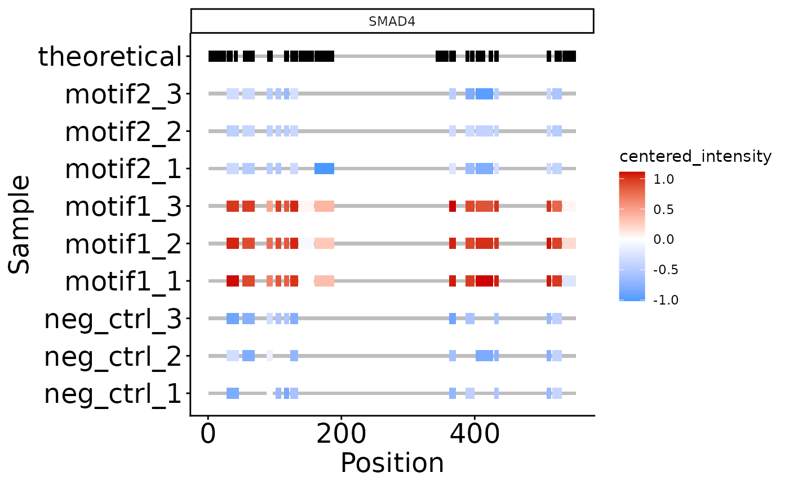
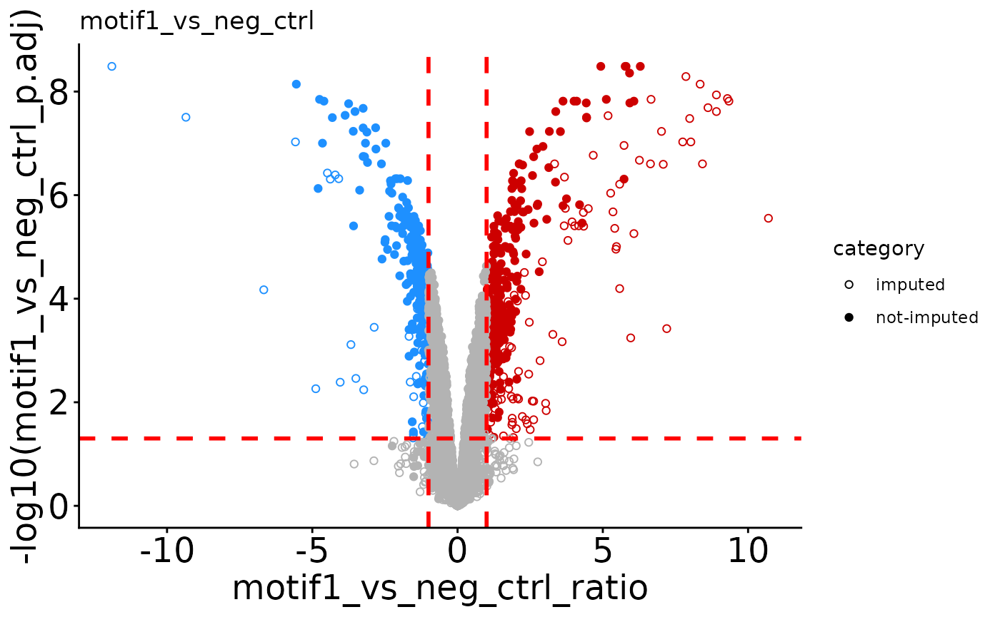
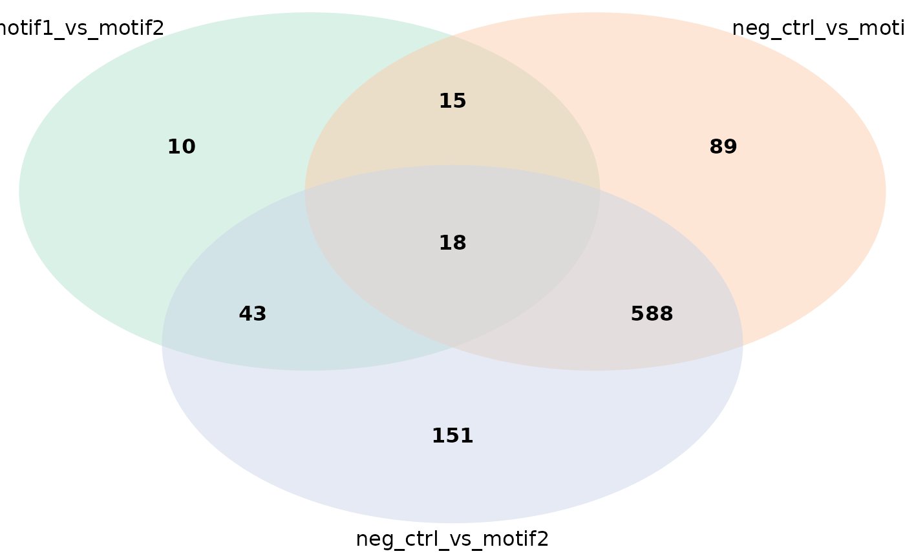
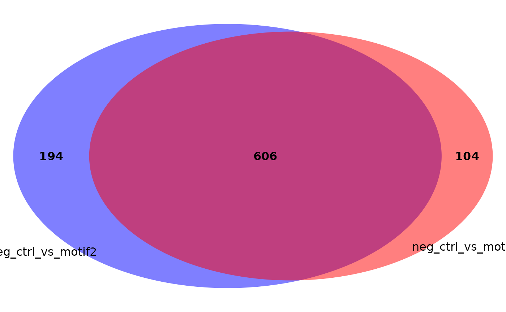
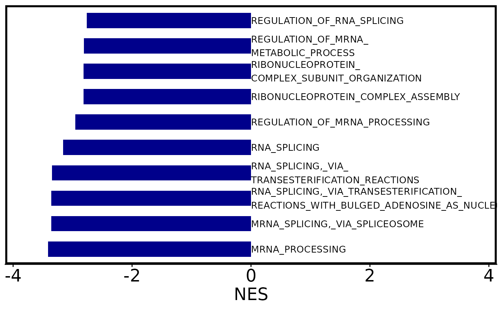
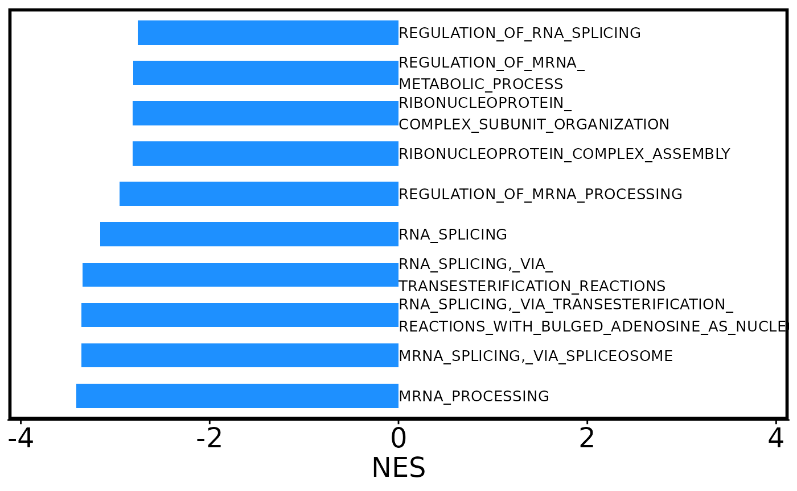
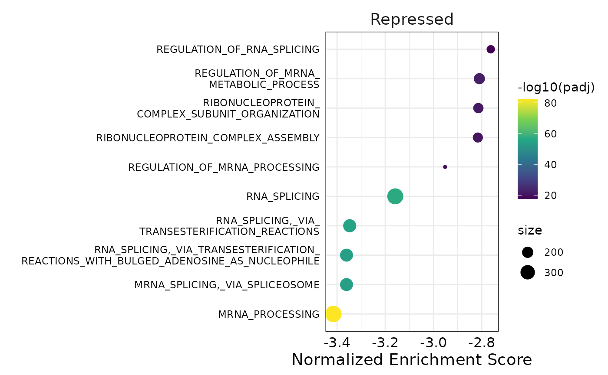
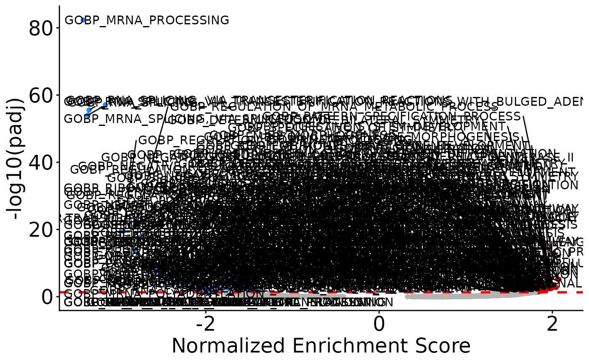
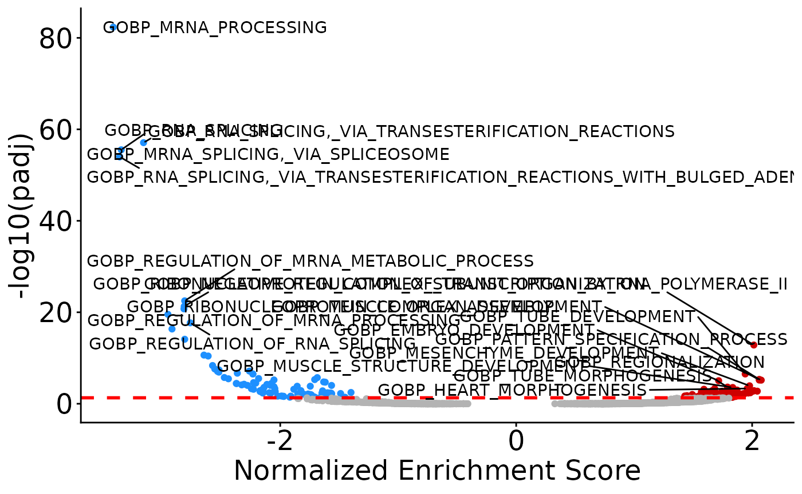
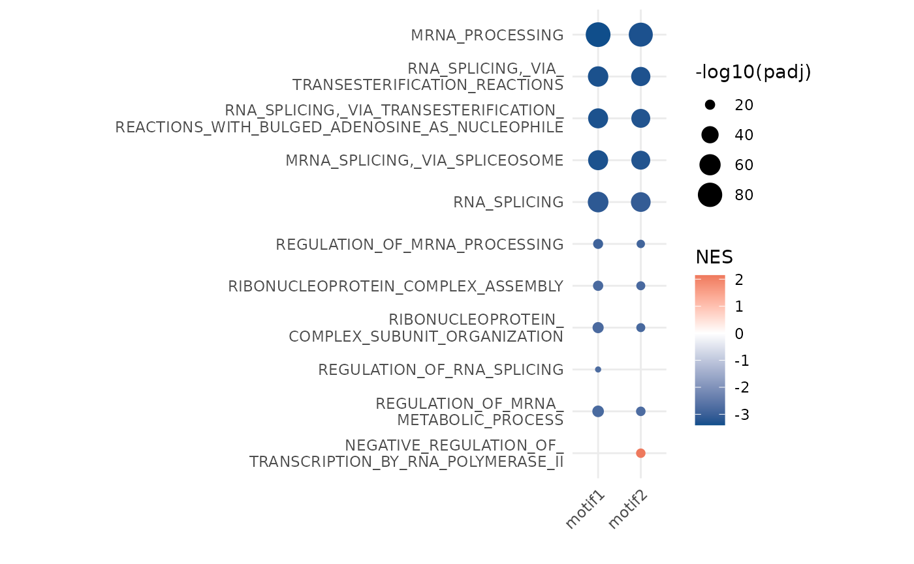

# DIANNmv

## Introduction

This package can be used to process and analyze mass spec data generated
by DIANN. It mainly uses the DEP package under the hood, so you can use
all DEP functions once you have created the summarizedExperiment object
(check out the DEP vignette). Also included are some visualization
function that I prefer over the default DEP options.

## Installation

Install and load the package from github with the following code (you
can ignore the warnings):

``` r
if (!require('BiocManager', quietly = T)){
  install.packages('BiocManager')
}

if (!require('devtools', quietly = T)){
  install.packages('devtools')
}

install_github('DijkJel/DIANNmv')
```

``` r
library(DIANNmv)
#> Warning: replacing previous import 'GSEABase::intersect' by
#> 'S4Vectors::intersect' when loading 'DIANNmv'
#> Warning: replacing previous import 'GSEABase::setdiff' by 'S4Vectors::setdiff'
#> when loading 'DIANNmv'
#> Warning: replacing previous import 'S4Vectors::cor' by 'stats::cor' when
#> loading 'DIANNmv'
#> Warning: replacing previous import 'S4Vectors::cov' by 'stats::cov' when
#> loading 'DIANNmv'
#> Warning: replacing previous import 'SummarizedExperiment::start' by
#> 'stats::start' when loading 'DIANNmv'
#> Warning: replacing previous import 'S4Vectors::window' by 'stats::window' when
#> loading 'DIANNmv'
#> Warning: replacing previous import 'S4Vectors::complete.cases' by
#> 'stats::complete.cases' when loading 'DIANNmv'
#> Warning: replacing previous import 'SummarizedExperiment::end' by 'stats::end'
#> when loading 'DIANNmv'
#> Warning: replacing previous import 'MsCoreUtils::smooth' by 'stats::smooth'
#> when loading 'DIANNmv'
#> Warning: replacing previous import 'S4Vectors::var' by 'stats::var' when
#> loading 'DIANNmv'
#> Warning: replacing previous import 'S4Vectors::xtabs' by 'stats::xtabs' when
#> loading 'DIANNmv'
#> Warning: replacing previous import 'S4Vectors::aggregate' by 'stats::aggregate'
#> when loading 'DIANNmv'
#> Warning: replacing previous import 'S4Vectors::na.omit' by 'stats::na.omit'
#> when loading 'DIANNmv'
#> Warning: replacing previous import 'S4Vectors::sd' by 'stats::sd' when loading
#> 'DIANNmv'
#> Warning: replacing previous import 'S4Vectors::na.exclude' by
#> 'stats::na.exclude' when loading 'DIANNmv'
library(SummarizedExperiment)
#> Loading required package: MatrixGenerics
#> Loading required package: matrixStats
#> 
#> Attaching package: 'MatrixGenerics'
#> The following objects are masked from 'package:matrixStats':
#> 
#>     colAlls, colAnyNAs, colAnys, colAvgsPerRowSet, colCollapse,
#>     colCounts, colCummaxs, colCummins, colCumprods, colCumsums,
#>     colDiffs, colIQRDiffs, colIQRs, colLogSumExps, colMadDiffs,
#>     colMads, colMaxs, colMeans2, colMedians, colMins, colOrderStats,
#>     colProds, colQuantiles, colRanges, colRanks, colSdDiffs, colSds,
#>     colSums2, colTabulates, colVarDiffs, colVars, colWeightedMads,
#>     colWeightedMeans, colWeightedMedians, colWeightedSds,
#>     colWeightedVars, rowAlls, rowAnyNAs, rowAnys, rowAvgsPerColSet,
#>     rowCollapse, rowCounts, rowCummaxs, rowCummins, rowCumprods,
#>     rowCumsums, rowDiffs, rowIQRDiffs, rowIQRs, rowLogSumExps,
#>     rowMadDiffs, rowMads, rowMaxs, rowMeans2, rowMedians, rowMins,
#>     rowOrderStats, rowProds, rowQuantiles, rowRanges, rowRanks,
#>     rowSdDiffs, rowSds, rowSums2, rowTabulates, rowVarDiffs, rowVars,
#>     rowWeightedMads, rowWeightedMeans, rowWeightedMedians,
#>     rowWeightedSds, rowWeightedVars
#> Loading required package: GenomicRanges
#> Loading required package: stats4
#> Loading required package: BiocGenerics
#> Loading required package: generics
#> 
#> Attaching package: 'generics'
#> The following objects are masked from 'package:base':
#> 
#>     as.difftime, as.factor, as.ordered, intersect, is.element, setdiff,
#>     setequal, union
#> 
#> Attaching package: 'BiocGenerics'
#> The following objects are masked from 'package:stats':
#> 
#>     IQR, mad, sd, var, xtabs
#> The following objects are masked from 'package:base':
#> 
#>     anyDuplicated, aperm, append, as.data.frame, basename, cbind,
#>     colnames, dirname, do.call, duplicated, eval, evalq, Filter, Find,
#>     get, grep, grepl, is.unsorted, lapply, Map, mapply, match, mget,
#>     order, paste, pmax, pmax.int, pmin, pmin.int, Position, rank,
#>     rbind, Reduce, rownames, sapply, saveRDS, table, tapply, unique,
#>     unsplit, which.max, which.min
#> Loading required package: S4Vectors
#> 
#> Attaching package: 'S4Vectors'
#> The following object is masked from 'package:utils':
#> 
#>     findMatches
#> The following objects are masked from 'package:base':
#> 
#>     expand.grid, I, unname
#> Loading required package: IRanges
#> Loading required package: Seqinfo
#> Loading required package: Biobase
#> Welcome to Bioconductor
#> 
#>     Vignettes contain introductory material; view with
#>     'browseVignettes()'. To cite Bioconductor, see
#>     'citation("Biobase")', and for packages 'citation("pkgname")'.
#> 
#> Attaching package: 'Biobase'
#> The following object is masked from 'package:MatrixGenerics':
#> 
#>     rowMedians
#> The following objects are masked from 'package:matrixStats':
#> 
#>     anyMissing, rowMedians
library(ggplot2)
```

## Required input data & example data

As input files you will need the protein (report.pg_matrix) and peptide
(report.pr_matrix) DIANN output files. In addition, you need an
experimental design table. This package comes with these files from a
DNA pull down experiment for demonstration goals.You can inspect the
data with ‘expDesign’, ‘report.pg_matrix’, and’report.pr_matrix’.

``` r

head(report.pg_matrix)
#>                  Protein.Group                      Protein.Names
#> 1 A0A075B6H7;A0A0C4DH55;P01624 KV315_HUMAN;KV37_HUMAN;KVD07_HUMAN
#> 2            A0A0A0MRZ8;P04433            KV311_HUMAN;KVD11_HUMAN
#> 3            A0A0B4J2D5;P0DPI2            GAL3A_HUMAN;GAL3B_HUMAN
#> 4                       A0A183                        LCE6A_HUMAN
#> 5                   A0A1B0GTR4                        SPRR5_HUMAN
#> 6                   A0A1B0GTU1                        ZC11B_HUMAN
#>                       Genes
#> 1 IGKV3-15;IGKV3-7;IGKV3D-7
#> 2        IGKV3-11;IGKV3D-11
#> 3              GATD3;GATD3B
#> 4                     LCE6A
#> 5                     SPRR5
#> 6                   ZC3H11B
#>                                                                      First.Protein.Description
#> 1                                    Probable non-functional immunoglobulin kappa variable 3-7
#> 2                                                          Immunoglobulin kappa variable 3D-11
#> 3 Putative glutamine amidotransferase-like class 1 domain-containing protein 3B, mitochondrial
#> 4                                                           Late cornified envelope protein 6A
#> 5                                                        Putative small proline-rich protein 5
#> 6                                               Zinc finger CCCH domain-containing protein 11B
#>   neg_ctrl_1 neg_ctrl_2 neg_ctrl_3 motif1_1 motif1_2 motif1_3 motif2_1 motif2_2
#> 1    35045.4         NA         NA  60838.8 56361.50  45830.7       NA  41375.0
#> 2    13531.4         NA         NA  26054.8       NA  50914.5  20547.4       NA
#> 3    50098.9   36549.70    43047.0  29253.3 25503.00  47893.5  36321.2  25036.7
#> 4    92060.5   92580.80         NA  49035.6 67543.30  33898.6       NA  33731.9
#> 5    57016.4   58424.50         NA 215301.0 77330.30       NA       NA  69601.4
#> 6    10773.4    9745.44    17668.3  16804.8  9534.48  17388.9  16438.0  25568.2
#>   motif2_3
#> 1 155669.0
#> 2  66331.5
#> 3  28612.7
#> 4       NA
#> 5  47255.0
#> 6       NA
#
#
#
head(report.pr_matrix)
#>   Protein.Group   Protein.Ids Protein.Names  Genes
#> 1        Q86U42        Q86U42   PABP2_HUMAN PABPN1
#> 2        Q8NFD5 Q8NFD5;Q9Y651   ARI1B_HUMAN ARID1B
#> 3        Q96JP5        Q96JP5   ZFP91_HUMAN  ZFP91
#> 4        Q16585        Q16585    SGCB_HUMAN   SGCB
#> 5        P36578        P36578     RL4_HUMAN   RPL4
#> 6        P36578        P36578     RL4_HUMAN   RPL4
#>                          First.Protein.Description Proteotypic
#> 1                  Polyadenylate-binding protein 2           1
#> 2 AT-rich interactive domain-containing protein 1B           0
#> 3                E3 ubiquitin-protein ligase ZFP91           1
#> 4                                 Beta-sarcoglycan           1
#> 5                         60S ribosomal protein L4           1
#> 6                         60S ribosomal protein L4           1
#>     Stripped.Sequence   Modified.Sequence Precursor.Charge         Precursor.Id
#> 1    AAAAAAAAAAGAAGGR    AAAAAAAAAAGAAGGR                2    AAAAAAAAAAGAAGGR2
#> 2         AAAAAAAAAAR         AAAAAAAAAAR                2         AAAAAAAAAAR2
#> 3        AAAAAAAAAVSR        AAAAAAAAAVSR                2        AAAAAAAAAVSR2
#> 4 AAAAAAAAEQQSSNGPVKK AAAAAAAAEQQSSNGPVKK                3 AAAAAAAAEQQSSNGPVKK3
#> 5         AAAAAAALQAK         AAAAAAALQAK                1         AAAAAAALQAK1
#> 6         AAAAAAALQAK         AAAAAAALQAK                2         AAAAAAALQAK2
#>   neg_ctrl_1 neg_ctrl_2 neg_ctrl_3    motif1_1   motif1_2   motif1_3
#> 1    14201.4    17402.1    22342.6     9617.31    12355.2    10824.8
#> 2 56500900.0 59560000.0 64613700.0 51690200.00 23066300.0 40866800.0
#> 3 12186100.0 12535000.0 15420900.0 28513800.00 32014600.0 43538700.0
#> 4         NA         NA         NA     8669.59         NA         NA
#> 5  3729720.0  4311790.0  2780390.0  3405560.00  4964600.0  4373450.0
#> 6 71649900.0 31629500.0 43972100.0 67226000.00 48326400.0 47199700.0
#>      motif2_1 motif2_2    motif2_3
#> 1    11469.50    11064     9728.03
#> 2 30508900.00 30926500 39211400.00
#> 3 41882400.00 53996100 30695300.00
#> 4     8965.43       NA          NA
#> 5  6242340.00  3104850  6942140.00
#> 6 32204200.00 40380400 39495700.00
#
#
#
expDesign
#>        label condition replicate
#> 1 neg_ctrl_1  neg_ctrl         1
#> 2 neg_ctrl_2  neg_ctrl         2
#> 3 neg_ctrl_3  neg_ctrl         3
#> 4   motif1_1    motif1         1
#> 5   motif1_2    motif1         2
#> 6   motif1_3    motif1         3
#> 7   motif2_1    motif2         1
#> 8   motif2_2    motif2         2
#> 9   motif2_3    motif2         3
```

As you can see in expDesign, there are three conditions with 3
replicates each: Two variations of a TF binding motif and one negative
control that can be used for both motifs. The names in the ‘label’
column correspond to the intensity columns in report.pg_matrix and
should be in the same order and identically named.

### Prepare input data

If the sample names in the report.pg_matrix and report.pr_matrix are
structured like , the prepare_diann_data() function can tidy the sample
names and create an experimentalDesign for you, which can be used
downstream. Alternatively, this can be done manually.

``` r
tidy_data <- prepare_diann_data(report.pg_matrix, report.pr_matrix)
#> Warning in max(which(!selection == T)): no non-missing arguments to max;
#> returning -Inf
#> Warning in colnames(pr_matrix)[start_index_pr:ncol(pr_matrix)] <- cn: number of
#> items to replace is not a multiple of replacement length
#>                 label condition replicate
#> neg_ctrl_3 neg_ctrl_3  neg_ctrl         3
#> motif1_1     motif1_1    motif1         1
#> motif1_2     motif1_2    motif1         2
#> motif1_3     motif1_3    motif1         3
#> motif2_1     motif2_1    motif2         1
#> motif2_2     motif2_2    motif2         2
#> motif2_3     motif2_3    motif2         3
pg_matrix <- tidy_data$pg_matrix
pr_matrix <- tidy_data$pr_matrix
```

### Prepare the Summarized Experiment object

The report.pg_matrix, report.pr_matrix and expDesign are combined in a
summarizedExperiment (se) object that is used for downstream analysis
and plotting.

To create an se object, you can run the prepare_se() function with the
report.pg_matrix file and associated experimental design. You can
specify if and what type of imputation is done. The default is ‘mixed’,
which uses both missing-not-at-random (MNAR) and missing-at-random (MAR)
imputation. For MNAR/MAR specific imputation, ‘knn’ and ‘MinProb’ are
advised, respectively. When ‘none’ is entered for the impute parameter,
no imputation is done. Additionally, you can filter on missing values
(missing_thr), and potential contaminants are removed by default.
(Source: contaminants.txt file from maxquant).

``` r
se <- prepare_se(report.pg_matrix, expDesign) # without peptide information
```


    #> Imputing along margin 2 (samples/columns).
    #> [1] 0.3058978
    #> Imputing along margin 1 (features/rows).
    #> Warning in knnimp(x, k, maxmiss = rowmax, maxp = maxp): 36 rows with more than 50 % entries missing;
    #>  mean imputation used for these rows
    #> Cluster size 5511 broken into 3577 1934 
    #> Cluster size 3577 broken into 2319 1258 
    #> Cluster size 2319 broken into 3 2316 
    #> Done cluster 3 
    #> Cluster size 2316 broken into 1144 1172 
    #> Done cluster 1144 
    #> Done cluster 1172 
    #> Done cluster 2316 
    #> Done cluster 2319 
    #> Done cluster 1258 
    #> Done cluster 3577 
    #> Cluster size 1934 broken into 1298 636 
    #> Done cluster 1298 
    #> Done cluster 636 
    #> Done cluster 1934
    se
    #> class: SummarizedExperiment 
    #> dim: 5547 9 
    #> metadata(0):
    #> assays(2): '' imputation_mask
    #> rownames(5547): A2M A2ML1 ... ZYX ZZZ3
    #> rowData names(7): Protein.Group Protein.Names ... name ID
    #> colnames(9): neg_ctrl_1 neg_ctrl_2 ... motif2_2 motif2_3
    #> colData names(4): label ID condition replicate

If you provide the report.pr_matrix alongside the report.pg_matrix,
peptide information is automatically added and you can filter on a
minimal number of razor/unique peptides (min_pep, default = 1). Make
sure the sample column names are identical and match the label column in
the experimental design.

``` r
# Add peptide information and remove all proteinGroups with <2 total 
# razor/unique peptides
se <- prepare_se(report.pg_matrix, expDesign, report.pr_matrix, min_pep = 2)
```


    #> Imputing along margin 2 (samples/columns).
    #> [1] 0.2967394
    #> Imputing along margin 1 (features/rows).
    #> Warning in knnimp(x, k, maxmiss = rowmax, maxp = maxp): 19 rows with more than 50 % entries missing;
    #>  mean imputation used for these rows
    #> Cluster size 5200 broken into 2219 2981 
    #> Cluster size 2219 broken into 1622 597 
    #> Cluster size 1622 broken into 940 682 
    #> Done cluster 940 
    #> Done cluster 682 
    #> Done cluster 1622 
    #> Done cluster 597 
    #> Done cluster 2219 
    #> Cluster size 2981 broken into 2256 725 
    #> Cluster size 2256 broken into 1138 1118 
    #> Done cluster 1138 
    #> Done cluster 1118 
    #> Done cluster 2256 
    #> Done cluster 725 
    #> Done cluster 2981
    se
    #> class: SummarizedExperiment 
    #> dim: 5219 9 
    #> metadata(1): pr_matrix
    #> assays(3): '' peptide_info imputation_mask
    #> rownames(5219): A2M A2ML1 ... ZYX ZZZ3
    #> rowData names(9): Protein.Group Protein.Names ... ID npep_total
    #> colnames(9): neg_ctrl_1 neg_ctrl_2 ... motif2_2 motif2_3
    #> colData names(4): label ID condition replicate

The summarizedExperiment object stores a lot of information. As you can
see from the output above, it consists of 5584 proteinGroups (rows) and
9 samples (columns). Furthermore, the experimental design is stored as
‘colData’, and extra information is stored as ‘rowData’. The log2
transformed intensities form the main assay. Furthermore, if the
report.pr_matrix file was provided, a second assay is added. For a
detailed description of the structure of summarizedExperiments, check
its documentation. In short, to access different parts of data:

``` r
intensities <- assay(se) # log2 protein intensities
peptides <- assay(se, 'peptide_info') # peptide numbers

rd = as.data.frame(rowData(se))
colnames(rd) # Information for each proteinGroup in the se.
#> [1] "Protein.Group"             "Protein.Names"            
#> [3] "Genes"                     "First.Protein.Description"
#> [5] "n_total"                   "Potential.contaminant"    
#> [7] "name"                      "ID"                       
#> [9] "npep_total"

cd = as.data.frame(colData(se)) 
cd # The experimental design
#>                 label         ID condition replicate
#> neg_ctrl_1 neg_ctrl_1 neg_ctrl_1  neg_ctrl         1
#> neg_ctrl_2 neg_ctrl_2 neg_ctrl_2  neg_ctrl         2
#> neg_ctrl_3 neg_ctrl_3 neg_ctrl_3  neg_ctrl         3
#> motif1_1     motif1_1   motif1_1    motif1         1
#> motif1_2     motif1_2   motif1_2    motif1         2
#> motif1_3     motif1_3   motif1_3    motif1         3
#> motif2_1     motif2_1   motif2_1    motif2         1
#> motif2_2     motif2_2   motif2_2    motif2         2
#> motif2_3     motif2_3   motif2_3    motif2         3
```

#### Note on integration with the DEP package

If your experimental design and sample labels follow the convention of ,
the created summararizedExperiment object should work seamlessly with
DEP. However, if you deviate from this structure (e.g.  use different
condition names than those that are in the sample names), you might run
into problems. If you want to use DEP functions anyways, you can run
use_dep() to make it work.

``` r
se_dep <- use_dep(se)
```

### Add peptide and iBAQ information

The report.pr_matrix and report.pg_matrix files can be used to add
peptide number information, iBAQ values, and median peptide intensities,
which are an alternative to iBAQ.

#### Add number of razor/unique peptides

This information is automatically added to the se object when running
prepare_se() and providing a report.pr_matrix file (see above). You can
also manually add this to the report.pg_matrix() file with the following
code.

To get the number of razor/unique peptides per proteinGroup per sample
and the total number of razor/unique peptides over all samples, and add
these to the report.pg_matrix file:

``` r
peptides <- get_nPep_prMatrix(report.pr_matrix)
pg_matrix <- add_peptide_numbers(report.pg_matrix, peptides)
```

This adds new columns with the suffix ‘npep’ to the report.pg_matrix
with the number of identified peptides per sample, and ‘n_total’ with
the total number of identified razor/unique peptides per proteinGroup.

``` r
colnames(pg_matrix)
#>  [1] "Protein.Group"             "Protein.Names"            
#>  [3] "Genes"                     "First.Protein.Description"
#>  [5] "neg_ctrl_1"                "neg_ctrl_2"               
#>  [7] "neg_ctrl_3"                "motif1_1"                 
#>  [9] "motif1_2"                  "motif1_3"                 
#> [11] "motif2_1"                  "motif2_2"                 
#> [13] "motif2_3"                  "neg_ctrl_1_npep"          
#> [15] "neg_ctrl_2_npep"           "neg_ctrl_3_npep"          
#> [17] "motif1_1_npep"             "motif1_2_npep"            
#> [19] "motif1_3_npep"             "motif2_1_npep"            
#> [21] "motif2_2_npep"             "motif2_3_npep"            
#> [23] "n_total"
```

#### Add iBAQ data

iBAQ values can be added to the pg_matrix file as well. For that, we
need the number of theoretically observable peptides, and non-normalized
intensities.

The number of iBAQ peptides for reviewed human and mouse uniprot entries
are included in the package and can be accessed with:

``` r
ibaq_peptides <- DIANNmv::ibaq_peptides
hs <- ibaq_peptides$hs #Human entries
mm <- ibaq_peptides$mm # Mouse entries
```

If you do not want to use these, you can create an similar object
yourself from a fasta file:

``` r
no_ibaq_peptides <- get_ibaq_peptides('path/to/fasta.fasta')
```

Non-normalized intensities can be calculated as sum of individual
peptide intensites from the report.pr_matrix file:

``` r
intensities <- get_intensities_prMatrix(report.pr_matrix)
```

This is all combined in the the add_iBAQ() function, which addes columns
with iBAQ values and a column with the number of iBAQ peptides to the
report.pg_matrix. If you use the included iBAQ peptides, you only have
to specify the organism. If you use a custom file, you have to specify
it with the ‘ibaq_stats’ parameter.

``` r
pg <- add_iBAQ(report.pg_matrix, report.pr_matrix, organism = 'hs') # Standard
colnames(pg)
#>  [1] "Protein.Group"             "Protein.Names"            
#>  [3] "Genes"                     "First.Protein.Description"
#>  [5] "neg_ctrl_1"                "neg_ctrl_2"               
#>  [7] "neg_ctrl_3"                "motif1_1"                 
#>  [9] "motif1_2"                  "motif1_3"                 
#> [11] "motif2_1"                  "motif2_2"                 
#> [13] "motif2_3"                  "neg_ctrl_1_iBAQ"          
#> [15] "neg_ctrl_2_iBAQ"           "neg_ctrl_3_iBAQ"          
#> [17] "motif1_1_iBAQ"             "motif1_2_iBAQ"            
#> [19] "motif1_3_iBAQ"             "motif2_1_iBAQ"            
#> [21] "motif2_2_iBAQ"             "motif2_3_iBAQ"            
#> [23] "ibaq_peptides"
```

  
  
The iBAQ values are automatically added to the summarizedExperiment
object when running the prepare_se() function. In addition, the number
of iBAQ peptides is added to the rowData.

``` r
pg <- add_iBAQ(report.pg_matrix, report.pr_matrix, organism = 'hs')
se <- prepare_se(pg, expDesign, report.pr_matrix)
```


    #> Imputing along margin 2 (samples/columns).
    #> [1] 0.3050842
    #> Imputing along margin 1 (features/rows).
    #> Warning in knnimp(x, k, maxmiss = rowmax, maxp = maxp): 33 rows with more than 50 % entries missing;
    #>  mean imputation used for these rows
    #> Cluster size 5475 broken into 3183 2292 
    #> Cluster size 3183 broken into 2053 1130 
    #> Cluster size 2053 broken into 1034 1019 
    #> Done cluster 1034 
    #> Done cluster 1019 
    #> Done cluster 2053 
    #> Done cluster 1130 
    #> Done cluster 3183 
    #> Cluster size 2292 broken into 1624 668 
    #> Cluster size 1624 broken into 716 908 
    #> Done cluster 716 
    #> Done cluster 908 
    #> Done cluster 1624 
    #> Done cluster 668 
    #> Done cluster 2292
    iBAQ <- as.matrix(assay(se, 'iBAQ'))
    head(iBAQ)
    #>       neg_ctrl_1  neg_ctrl_2 neg_ctrl_3   motif1_1  motif1_2  motif1_3
    #> A2M    44908.143  43355.8406   64753.94  41528.739 123416.60  21931.53
    #> A2ML1 112836.227 154355.9719   88353.84 136172.283 135247.20 156184.82
    #> AAAS  595275.548 778864.7519  733462.15 248484.556 725698.24 489673.48
    #> AAK1   24854.583    126.1392   26950.56  23150.526  19485.50  22769.03
    #> AAR2   29334.317 183248.0889   39214.12   3291.122  35568.44  33472.99
    #> AARS1   3359.781  10436.0490       0.00      0.000   2132.97   2367.20
    #>         motif2_1  motif2_2   motif2_3
    #> A2M     4432.100 108122.55  85534.064
    #> A2ML1  47171.734  77564.26 106892.719
    #> AAAS  278873.133 263530.63 505940.196
    #> AAK1       0.000      0.00  21978.459
    #> AAR2  201094.172 108991.24 177086.150
    #> AARS1   1908.576   3763.05   2011.761

    ibaq_pep <- rowData(se)$ibaq_peptides
    head(ibaq_pep)
    #> [1] 69 64 27 36 18 50

#### Add median peptide intensities

Similarly, median peptide intensities (mpi) can be added. To get the mpi
as separate object:

``` r
mpi <- get_median_intensities_prMatrix(report.pr_matrix)
head(mpi)
#>                        protein neg_ctrl_1 neg_ctrl_2 neg_ctrl_3  motif1_1
#> 1 A0A075B6H7;A0A0C4DH55;P01624    35045.4         NA         NA  60838.90
#> 2            A0A0A0MRZ8;P04433    13531.4    5577.47         NA  26054.80
#> 3            A0A0B4J2D5;P0DPI2    31083.5   23493.25    17767.3  18834.27
#> 4                       A0A183    74635.8   96073.55         NA  64140.95
#> 5                   A0A1B0GTR4    56976.9   58384.00         NA 148435.10
#> 6                   A0A1B0GTU1   255493.0    9745.44    17668.3  16804.80
#>    motif1_2 motif1_3 motif2_1 motif2_2  motif2_3
#> 1  56361.40  45830.7       NA  41375.0 155669.00
#> 2  25558.50  50914.5  20547.4       NA  66331.50
#> 3 249944.00  21172.3  25210.3 192574.0 267984.40
#> 4  78935.65  82479.8       NA  78484.7        NA
#> 5  47525.95       NA  65137.5  71409.6  23997.25
#> 6   9534.49  17388.9  16438.0  25568.2   8499.39
```

To add mpi to the se object directly (this requires that the se includes
the pr_matrix when running prepare_se()):

``` r

 se <- add_median_peptide_intensity(se)
 se # an extra assay 'median_peptide_intensities' is added
#> class: SummarizedExperiment 
#> dim: 5508 9 
#> metadata(1): pr_matrix
#> assays(6): '' iBAQ ... imputation_mask median_peptide_intensities
#> rownames(5508): A2M A2ML1 ... ZYX ZZZ3
#> rowData names(11): Protein.Group Protein.Names ... npep_total
#>   baseMean_mpi
#> colnames(9): neg_ctrl_1 neg_ctrl_2 ... motif2_2 motif2_3
#> colData names(4): label ID condition replicate
 mpi <- assay(se, 'median_peptide_intensities')
 
 rd <- as.data.frame(rowData(se))
 head(rd$baseMean_mpi) # shows the average mpi per proteinGroup over all samples
#> [1] 339967.8 366450.2 411634.6 600430.1 307316.9 108054.2
```

### Differential protein analysis

To perform differential protein expression analysis, you have to run the
get_DEPresults() function. There are three main types: ‘manual’ (1 vs
1), ‘control’ (all vs 1), and ‘all’ (all vs all). For ‘manual’, you can
also specify the contrasts you want to test by providing a character
vector for the ‘tests’ parameter.In addition, you can choose the p.adj
cutoff and log2 fold change cutoffs for significant, and the method of
FDR correction. The DEP default is ‘fdrtool’, but this has given some
weird results in the past. Therefore, the default here is ‘BH’
(Benjamini-Hochberg), which is also the default that limma uses (which
DEP uses in the background).

get_DEPresults returns a data frame with statistics for the specified
tests, and can be used for visualization afterwards.

``` r

# To test a 1 vs 1 comparison
res_man <- get_DEPresults(se, condition1 = 'motif1', condition2 = 'neg_ctrl',
                      type = 'manual')
#> Tested contrasts: motif1_vs_neg_ctrl

# To test multiple 1 vs 1 comparisons
res_man2 <- get_DEPresults(se,
                           tests = c('motif1_vs_neg_ctrl', 'motif1_vs_motif2'),
                           type = 'manual')
#> Tested contrasts: motif1_vs_neg_ctrl, motif1_vs_motif2

# To test all conditions vs 1 reference condition
res_ref <- get_DEPresults(se, ref_condition = 'neg_ctrl', type = 'control')
#> Tested contrasts: motif1_vs_neg_ctrl, motif2_vs_neg_ctrl

# To test all vs all
res <- get_DEPresults(se, type = 'all')
#> Tested contrasts: neg_ctrl_vs_motif1, neg_ctrl_vs_motif2, motif1_vs_motif2
```

## Plotting

### Protein Coverage

To plot the coverage and intensity of identified peptides of a protein,
you can use plot_protein_coverage(). This expects the report.pr_matrix
file. You can plot multiple proteins faceted, and highlight amino acid
positions in the protein. By default, overlapping peptides (e.g. due to
miscleavages) are combined and the intensities are summed.

``` r
# The default option
smad4 <- plot_protein_coverage(se, 'SMAD4')
#> Warning: Duplicated aesthetics after name standardisation: ymin
smad4
#> Warning: Duplicated aesthetics after name standardisation: ymin
#> Duplicated aesthetics after name standardisation: ymin
```



``` r


# Indicate amino acid positions and zoom in on aa 50-200 of protein:
smad4_zoom <- plot_protein_coverage(se, 'SMAD4', c(100, 120),
                                    zoom = c(50, 200))
#> Warning: Duplicated aesthetics after name standardisation: ymin
#> Coordinate system already present.
#> ℹ Adding new coordinate system, which will replace the existing one.

smad4_zoom
#> Warning: Duplicated aesthetics after name standardisation: ymin
#> Duplicated aesthetics after name standardisation: ymin
```


### Volcano plots

The plotVolcano() function returns volcano plots with the specified
significance cutoffs. If more than 1 comparison is present in your
results data frame, a list of volcano plots will be returned which can
be accessed by the ‘\$’ operator. By default, proteins that have any
imputed values in the two conditions compared will be specified. Check
the help page for plotVolcano()
([`?plotVolcano`](https://dijkjel.github.io/DIANNmv/reference/plotVolcano.md))
to see the different options for labeling specific points in the
volcano.

``` r

plotVolcano(res_man) # Default volcano plot if one comparison is present.
```


``` r
                    # labels all significant points (can be a bit much).


volcano_list <- plotVolcano(res_ref, label = '') # returns list of volcano plots
                                                 # Don't label anything.
volcano_list$motif1_vs_neg_ctrl # Select which plot you want to see.
```



``` r

# Example of a very ugly volcano plot.
plotVolcano(res_man, pval_cutoff = 0.001, fc_cutoff = 2,
            up_color =  'blue', down_color = 'yellow', ns_color = 'green',
            label = c('SMAD3', 'SMAD4'))
```


### MA-plots

If median_peptide_intensities are added to the se, you can also plot an
MA-plot, with abundances on the x-axis, and fold-changes on the y-axis.
Significant hits are indicated in blue/red:

``` r
plot_MA(res_man, label = c('SMAD3', 'SMAD4'))
#> Warning: Removed 1 row containing missing values or values outside the scale range
#> (`geom_point()`).
#> Warning: Removed 1 row containing missing values or values outside the scale range
#> (`geom_text_repel()`).
```


### Venn diagrams

You can also make a Venn diagram showing overlapping significant
proteins. By default, all comparisons present in your results data frame
are used, but it can handle five comparisons maximally. You can specify
which comparisons to include.

``` r
plot_venn_diagram(res) # all comparisons
#> INFO [2026-01-21 15:39:57] [[1]]
#> INFO [2026-01-21 15:39:57] venn_list
#> INFO [2026-01-21 15:39:57] 
#> INFO [2026-01-21 15:39:57] $filename
#> INFO [2026-01-21 15:39:57] NULL
#> INFO [2026-01-21 15:39:57] 
#> INFO [2026-01-21 15:39:57] $disable.logging
#> INFO [2026-01-21 15:39:57] T
#> INFO [2026-01-21 15:39:57] 
#> INFO [2026-01-21 15:39:57] $fill
#> INFO [2026-01-21 15:39:57] colors
#> INFO [2026-01-21 15:39:57] 
#> INFO [2026-01-21 15:39:57] $fontfamily
#> INFO [2026-01-21 15:39:57] [1] "sans"
#> INFO [2026-01-21 15:39:57] 
#> INFO [2026-01-21 15:39:57] $fontface
#> INFO [2026-01-21 15:39:57] [1] "bold"
#> INFO [2026-01-21 15:39:57] 
#> INFO [2026-01-21 15:39:57] $cat.fontfamily
#> INFO [2026-01-21 15:39:57] [1] "sans"
#> INFO [2026-01-21 15:39:57] 
#> INFO [2026-01-21 15:39:57] $lty
#> INFO [2026-01-21 15:39:57] [1] 0
#> INFO [2026-01-21 15:39:57]
```



``` r
plot_venn_diagram(res, comparisons = c('neg_ctrl_vs_motif1', 
                                       'neg_ctrl_vs_motif2')) # only two comp.
#> INFO [2026-01-21 15:39:57] [[1]]
#> INFO [2026-01-21 15:39:57] venn_list
#> INFO [2026-01-21 15:39:57] 
#> INFO [2026-01-21 15:39:57] $filename
#> INFO [2026-01-21 15:39:57] NULL
#> INFO [2026-01-21 15:39:57] 
#> INFO [2026-01-21 15:39:57] $disable.logging
#> INFO [2026-01-21 15:39:57] T
#> INFO [2026-01-21 15:39:57] 
#> INFO [2026-01-21 15:39:57] $fill
#> INFO [2026-01-21 15:39:57] colors
#> INFO [2026-01-21 15:39:57] 
#> INFO [2026-01-21 15:39:57] $fontfamily
#> INFO [2026-01-21 15:39:57] [1] "sans"
#> INFO [2026-01-21 15:39:57] 
#> INFO [2026-01-21 15:39:57] $fontface
#> INFO [2026-01-21 15:39:57] [1] "bold"
#> INFO [2026-01-21 15:39:57] 
#> INFO [2026-01-21 15:39:57] $cat.fontfamily
#> INFO [2026-01-21 15:39:57] [1] "sans"
#> INFO [2026-01-21 15:39:57] 
#> INFO [2026-01-21 15:39:57] $lty
#> INFO [2026-01-21 15:39:57] [1] 0
#> INFO [2026-01-21 15:39:57]
```


``` r

plot_venn_diagram(res, comparisons = c('neg_ctrl_vs_motif1', 
                                       'neg_ctrl_vs_motif2'), 
                  colors = c('red', 'blue')) # specify colors used
#> INFO [2026-01-21 15:39:58] [[1]]
#> INFO [2026-01-21 15:39:58] venn_list
#> INFO [2026-01-21 15:39:58] 
#> INFO [2026-01-21 15:39:58] $filename
#> INFO [2026-01-21 15:39:58] NULL
#> INFO [2026-01-21 15:39:58] 
#> INFO [2026-01-21 15:39:58] $disable.logging
#> INFO [2026-01-21 15:39:58] T
#> INFO [2026-01-21 15:39:58] 
#> INFO [2026-01-21 15:39:58] $fill
#> INFO [2026-01-21 15:39:58] colors
#> INFO [2026-01-21 15:39:58] 
#> INFO [2026-01-21 15:39:58] $fontfamily
#> INFO [2026-01-21 15:39:58] [1] "sans"
#> INFO [2026-01-21 15:39:58] 
#> INFO [2026-01-21 15:39:58] $fontface
#> INFO [2026-01-21 15:39:58] [1] "bold"
#> INFO [2026-01-21 15:39:58] 
#> INFO [2026-01-21 15:39:58] $cat.fontfamily
#> INFO [2026-01-21 15:39:58] [1] "sans"
#> INFO [2026-01-21 15:39:58] 
#> INFO [2026-01-21 15:39:58] $lty
#> INFO [2026-01-21 15:39:58] [1] 0
#> INFO [2026-01-21 15:39:58]
```



### Upset plot

As an alternative to Venn diagrams, you can also plot protein membership
as an upset plot. Individual components of the plot can be altered after
the plot is made. Check the ‘ggupset’ vignette for instructions on how
to do this.

``` r

upset_plot <- plot_upset(res)
upset_plot
#> Warning: Using `size` aesthetic for lines was deprecated in ggplot2 3.4.0.
#> ℹ Please use `linewidth` instead.
#> ℹ The deprecated feature was likely used in the ggupset package.
#>   Please report the issue at <https://github.com/const-ae/ggupset/issues>.
#> This warning is displayed once per session.
#> Call `lifecycle::last_lifecycle_warnings()` to see where this warning was
#> generated.
```


Finally, to get an overview of the number of identified significant
proteins per condition:

``` r
plot_DEP_barplot(res)
```


You can change the conditions included, order of columns, and labels:

``` r

# Include only two comparisons and change the order:
plot_DEP_barplot(res, comparisons = c('neg_ctrl_vs_motif2',
                                      'neg_ctrl_vs_motif1'))
```


``` r

# Same as above, but axis labels are changed.
plot_DEP_barplot(res, comparisons = c('neg_ctrl_vs_motif2',
                                      'neg_ctrl_vs_motif1'),
                 names = c('motif2', 'motif1'))
```


## Gene set enrichment analysis (GSEA)

GSEA can be performed on the results from get_DEPresults(). This only
works if the results object contains one comparison. It does not make a
lot of sense to do GSEA on a DNA pull down, but this will be used for
demonstration purposes nonetheless.

In addition to a results object, you need gene sets that you want to
test. For this, you need to download the msigdb superset with gene sets,
and extract the sets that you want. Most commonly, cancer hallmarks (h),
curated gene sets (c2) and gene ontology gene sets (c5) are used. To
extract these:

``` r

db <- load_msigdb(organism = 'hs') # loads the super set
#> see ?msigdb and browseVignettes('msigdb') for documentation
#> downloading 1 resources
#> retrieving 1 resource
#> loading from cache
#> require("GSEABase")
#> 
#> Warning in getMsigOrganism(gsc, idType): Assuming the organism to be human.

# retrieve the cancer hallmarks 
geneset_hallmarks <- get_genesets(db, collection = 'h') 

# retrieve the GO:biological process gene sets.
# similarly molecular function (GOMF) and cellular compartment (GOCC) can be 
# retrieved
geneset_gobp <- get_genesets(db, collection = 'c5', subcollection = 'GOBP')
```

To perform GSEA, use the results object and the gene sets of choice:

``` r

res <- get_DEPresults(se, 'motif1', 'neg_ctrl')
#> Tested contrasts: motif1_vs_neg_ctrl
gsea <- perform_GSEA(res, geneset_gobp)
```

### Plotting of GSEA results

There are several options to visualize your GSEA results. The simplest
is with a bar plot, showing just the Normalized Enrichment Scores (NES).
The default options shows all significant results. Be specifying the
top_n parameter, you can only include the n pathways with the lowest
padj value.

We also remove the prefix, and shorten the names of the pathways to a
maximum of 35 characters.

``` r
# Bar plot of 10 pathways with lowest padj values.
barplot <- plot_gsea_barplot(gsea, top_n = 10, remove_prefix = T,
                             max_name_length = 35)
barplot
```



``` r

#Bar plot of 10 pathways with lowest values and different colors for bars.
barplot2 <- plot_gsea_barplot(gsea, pos_color = 'red3', 
                              neg_color = 'dodgerblue', top_n = 10, 
                              remove_prefix = T, max_name_length = 35)

barplot2
```



With the plot_gsea_dotplot() function, you can include more information
about the pathways:

``` r

dotplot <- plot_gsea_dotplot(gsea, top_n = 10,
                             remove_prefix = T, max_name_length = 35)

dotplot
```



A third way way to visualize the results from GSEA is with a volcano
plot with the NES on the x-axis and -log10(padj) on the y-axis. Like
with the volcano plot for DEP visualization, you can specify how to
label points.

``` r
# Plot all significant points (can be chaotic)
volcano <- plot_gsea_volcano(gsea)

volcano
```



``` r

# plot 10 significant points with the lowest padj value on both sides of volcano.
volcano <- plot_gsea_volcano(gsea, top_n = 10)
                              

volcano
```



If you ran multiple GSEAs on different results objects (from
get_DEPresults()), you can plot them in a single bubble plot.

``` r

res1 <- get_DEPresults(se, 'motif1', 'neg_ctrl')
#> Tested contrasts: motif1_vs_neg_ctrl
res2 <- get_DEPresults(se, 'motif2', 'neg_ctrl')
#> Tested contrasts: motif2_vs_neg_ctrl

gsea1 <- perform_GSEA(res1, geneset_gobp)
gsea2 <- perform_GSEA(res2, geneset_gobp)

bubble <- plot_gsea_bubbleplot(gsea1, gsea2,
                               sample_names = c('motif1', 'motif2'), top_n = 10,
                                remove_prefix = T, max_name_length = 35)

bubble
#> Warning: Removed 2 rows containing missing values or values outside the scale range
#> (`geom_point()`).
```



Finally, you can plot enrichment plots for individual pathways with
plot_gsea_enrichment_plot():

``` r
pathways <- c('HALLMARK_MYC_TARGETS_V1', 'HALLMARK_TGF_BETA_SIGNALING')
enrichment_plots <- plot_gsea_enrichment_plot(geneset_hallmarks, pathways, res)

enrichment_plots$HALLMARK_MYC_TARGETS_V1
```


